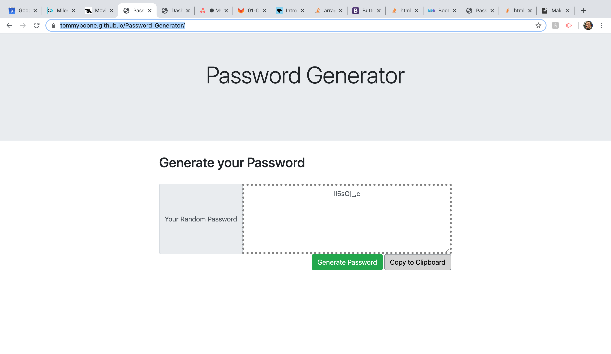

# Password_Generator

    Password_Generator was made using Bootstrap CDN, Javascript, and an external CSS.

# GitHub Pages Link

    https://tommyboone.github.io/Password_Generator/

#Screenshot

# Usage
    The user answers a series of [confirm] messages to determine the length and types of characters that will be used in their random password. From there the page loads to display a text box that will show their first random password. If they would like to generate another, they will click the 'Generate Password' button to create a new password based on the same criteria they selected previously. There is also the "Copy to Clipboard" button that will the select the password in the text box and copy to the clipboard so they can paste elsewhere. 

